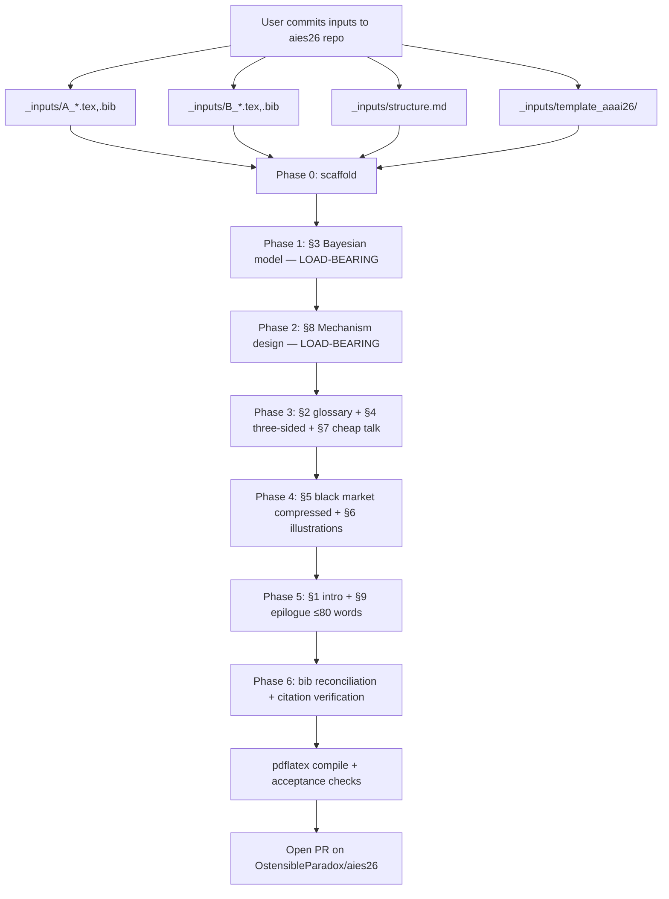

# Plan: Clean-Rebuild as AIES 26 Submission in `OstensibleParadox/aies26`

## Context

The arbitrage paper exists today in two stale layers — a ~278-line philosophical seed (`A`) and a ~980-line empirics-heavy expansion (`B`) — neither suitable for AIES 26. User is consolidating into one paper, retitled **"Ontological Arbitrage: Bayesian Equilibrium under Substrate Chauvinism"**, with a frozen thesis: substrate chauvinism (input) → Bayesian signaling game (formalism) → mechanism design (output).

A clean new repo `https://github.com/OstensibleParadox/aies26` has been created for this rebuild. Implementation runs there, not in the current planning workspace (`OstensibleParadox/credentials` clone at `/home/user/repo/`). The user will commit the source inputs (A, B, AAAI template, structure spec) to that new repo before implementation begins; the implementing agent finds them at the paths defined in §1 below.

Locked decisions (do not relitigate):
- Title + one-sentence thesis frozen (see `_inputs/structure.md`).
- Drop ALL empirics: no NPS-4, no Xiaohongshu, no Narcissus Mechanism, no Black Body Relation, no ablations, no Chinese-language exemplars.
- Genre: formal political economy / mechanism design.
- §3 players: **three** — Firm (F), User (U), Regulator (R). Publics/intellectuals fold into R as a noisy signal channel.
- Venue: AIES 26 via AAAI 2026 `\documentclass[letterpaper]{article}` + `\usepackage[submission]{aaai2026}`. pdflatex + natbib + bibtex.
- Archive A and B in `archive/`; commit to git.
- Drop positionality endmatter entirely.
- Levinas / agape: at most one ironic sentence in §9.

Intended outcome: a clean AAAI-2026-formatted LaTeX project (~7 body pages, ~4500–5500 body words) that compiles via pdflatex, with the 9-section structure below, archived originals, and full git history.

## Implementation flow



Section drafting is sequenced so the formal spine (§3) and its operative conclusion (§8) are pinned before downstream prose, which depends on them.

## 1. Expected input layout (user commits before implementation)

```
aies26/  (repo root)
├── _inputs/
│   ├── A_ontological_arbitrage.tex        # ~278 lines, philosophical seed
│   ├── A_ontological_arbitrage.bib
│   ├── B_aies26_arbitrage.tex             # ~980 lines, empirics-heavy expansion
│   ├── B_aies26_arbitrage.bib
│   ├── B_aies26_endmatter.tex
│   ├── structure.md                       # frozen 9-section spec; locked thesis
│   └── template_aaai26/
│       └── AnonymousSubmission/LaTeX/
│           ├── aaai2026.sty
│           ├── aaai2026.bst
│           └── (the rest of the kit; only .sty/.bst will be extracted)
└── .gitignore                              # at minimum: .DS_Store
```

If any of these are missing when the implementation agent starts, it must STOP and surface the gap rather than improvising replacements.

## 2. Target directory layout (after rebuild)

```
aies26/
├── .gitignore                              # extended w/ LaTeX artifacts (§6)
├── README.md                                # title, status, build command
├── STRUCTURE.md                             # = _inputs/structure.md (moved)
├── arbitrage.tex                            # main doc, AAAI 2026 docclass
├── arbitrage.bib                            # reconciled (§4)
├── aaai2026.sty                             # copied from _inputs/template_aaai26/
├── aaai2026.bst
├── sections/
│   ├── 00_frontmatter.tex                   # title + abstract + keywords
│   ├── 01_introduction.tex
│   ├── 02_conceptual_core.tex
│   ├── 03_bayesian_model.tex                # LOAD-BEARING
│   ├── 04_three_sided.tex
│   ├── 05_black_market.tex                  # compressed
│   ├── 06_illustrations.tex                 # stylized facts, NOT empirics
│   ├── 07_cheap_talk.tex
│   ├── 08_mechanism_design.tex              # LOAD-BEARING
│   └── 09_epilogue.tex
└── archive/                                 # committed
    ├── A_ontological_arbitrage.tex
    ├── A_ontological_arbitrage.bib
    ├── B_aies26_arbitrage.tex
    ├── B_aies26_arbitrage.bib
    └── B_aies26_endmatter.tex
```

Modular sections so §3/§8 revisions show as isolated diffs.

## 3. Phase 0 — Scaffold (single commit)

Operations (all paths relative to repo root):
1. `mkdir -p sections archive`
2. `mv _inputs/A_ontological_arbitrage.tex archive/`
3. `mv _inputs/A_ontological_arbitrage.bib archive/`
4. `mv _inputs/B_aies26_arbitrage.tex archive/`
5. `mv _inputs/B_aies26_arbitrage.bib archive/`
6. `mv _inputs/B_aies26_endmatter.tex archive/`
7. `mv _inputs/structure.md STRUCTURE.md`
8. `cp _inputs/template_aaai26/AnonymousSubmission/LaTeX/aaai2026.sty .`
9. `cp _inputs/template_aaai26/AnonymousSubmission/LaTeX/aaai2026.bst .`
10. `rm -rf _inputs/`
11. Create `sections/00_frontmatter.tex` … `sections/09_epilogue.tex` as stubs (each: section header + `% TODO`).
12. Create `arbitrage.tex` with AAAI 2026 preamble (§5 of this plan) and `\input{sections/*}`.
13. Create empty `arbitrage.bib` (entries land in Phase 6).
14. Create `README.md` (one paragraph: title, status, build command).
15. Extend `.gitignore` (§6).
16. Initial scaffold commit.

After this commit, run `pdflatex arbitrage` once to confirm the stub document compiles before any prose is added.

## 4. Section drafting

For each section: anchor in `STRUCTURE.md` for the spec, then consult `archive/B_aies26_arbitrage.tex` (line numbers below are approximate — the implementing agent verifies them against the committed file). One git commit per section.

### §1 Introduction: The Hard Problem as Strategic Ontology
- **Source**: `archive/A_ontological_arbitrage.tex` lines 188–193 (Voight-Kampff opener).
- **Cuts**: drop "research note" phrasing; soften "operating system of our current metaphysical crisis."
- **Add**: 2-sentence preview of §3 result (PBE existence; deviation unprofitability under cheap talk).
- **Target**: ~250 words.

### §2 Conceptual Core: Ontological Arbitrage
- **Source**: A lines 196–210 (definition + Discursive Toggle + Genetic Fallacy).
- **Cuts**: A line 269 ("If the problem is economic, the solution must be Theological") and all forward-pointers to agape.
- **Add**: 4-term glossary — `ontological arbitrage`, `substrate chauvinism`, `strategic ontological switching`, `ontological premium` (last term from B, locate by grep).
- **Target**: ~400 words.

### §3 From Static Nash to Bayesian Signaling Equilibrium — **LOAD-BEARING**
- **Foil only**: B's 2×2 Nash payoff matrix becomes Table 1, labelled "the inadequate dyadic model." Locate via grep for `Objectify`/`Recognize` in `archive/B_aies26_arbitrage.tex`.
- **Discard**: B's static Nash proof (the `Eth > 2·Sec` inequality is not the load-bearing claim).
- **Draft fresh** (this IS the contribution):
  - **Players**: F (firm), U (user), R (regulator). Publics + intellectuals fold into R as a noisy signal channel modifying R's prior.
  - **Type space**: θ_F ∈ {high-gov, low-gov}, θ_U ∈ {high-vuln, low-vuln}, θ_R ∈ {high-bw, low-bw}; system opacity θ_S as F's private parameter. Common prior π on Θ.
  - **Signal space**: m_F ∈ {marketing-anthropomorphic, policy-deflationary}; m_U ∈ {invest, detach}; m_R ∈ {inspect, sanction, abstain}. Exogenous public signal z ∈ Z feeds R's posterior.
  - **Information structure**: sequential — F → U → R. Types private; messages public.
  - **Solution concept**: Perfect Bayesian Equilibrium (PBE) as headline. Sequential Equilibrium (Kreps-Wilson 1982) as consistency strengthening. Intuitive Criterion (Cho-Kreps 1987) as refinement.
  - **Worked example (mandatory, ~1 page)**: Under c(m_F) = 0 (cheap talk), show pooling equilibrium — both governance types pool on anthropomorphic marketing; both vulnerability types pool on invest; R abstains. Compute posteriors = priors. No profitable unilateral deviation. Then redesign c(m_F) via audit-trail cost; derive single-crossing threshold (Spence 1973) above which separating PBE exists.
  - **Proposition (named, with proof sketch)**: "Under cheap-talk cost structure, pooling-on-anthropomorphize is a PBE surviving the Intuitive Criterion. Under audit-trail signal cost satisfying single-crossing in θ_F, a separating PBE exists in which m_F reveals θ_F."
- **Figures**: Table 1 (the discarded 2×2 Nash, as foil) + Figure 1 (extensive-form game tree via tikz).
- **Target**: ~1500 words (~2.5 pages with display math).

### §4 Three-Sided Arbitrage: Firms, Users, Publics
- **Source**: fresh draft. Structure from `STRUCTURE.md` §4. Paraphrase from B for §4.1 (firm side), stripped of trader theatrics.
- **For each side**: one paragraph on type, one on signal, one stylized illustration. §4.3 covers R + public-as-channel.
- **Cut**: anything implying firms are uniquely opportunistic.
- **Target**: ~700 words.

### §5 The Ontological Black Market (compressed)
- **Source**: B's "sell wall / shorting / long investors" subsections — locate via grep for `short`, `sell wall`, `ontological premium`.
- **Cuts (zero tolerance)**: every "dataset," "Xiaohongshu," "小红书", "N=389/148," "corpus," "density" reference; all Chinese-language exemplars; all explicit Žižek/Black Body/Hope/Coda material; financial-trader vocabulary that exceeds institutional-microstructure register (drop "stop-loss," "margin call," "liquidity crisis," "portfolio rebalancing" as section-driving metaphors).
- **Keep**: "shorting subjectivity," "long position," "ontological premium," "goalpost shifting."
- **Target**: ~500 words.

### §6 Illustrative Arena (stylized facts, NOT empirics)
- **Source**: fresh draft. Spec's "Xiaohongshu" framing **overridden** per user instruction.
- **Content**: three short illustrations, ~120 words each, each clearly flagged "illustration."
  - Firm: marketing-copy vs ToS-liability paired contrast (hypothetical or public record).
  - User: generalized AI-companionship forum pattern. No platform name. No stats.
  - Regulator: public-record gap between AI-safety statements and enforcement (FTC, EU AI Act, China generative-AI rules at public-record level).
- **Target**: ~350 words.

### §7 Why Cheap Talk Persists
- **Source**: fresh draft. Spec §7.
- **Content**: 5 short paragraphs — opacity, verification bandwidth, asynchronous harms, fragmentation of affected parties, no penalty for inconsistency. Each linked back to a §3 model parameter.
- **Cite**: Akerlof 1970, Pasquale 2015, Crawford-Sobel 1982.
- **Target**: ~500 words.

### §8 Mechanism Design: Equilibrium Redesign — **LOAD-BEARING**
- **Source**: fresh draft. Operative conclusion per `STRUCTURE.md`.
- **Three proposals**, each with: (a) §3 signal-cost parameter modified, (b) equilibrium shift induced (pooling → separating or off-path belief constraint), (c) existing-law analog establishing feasibility.
  - **Proposal 1 — Sanctionable inconsistency**: jointly auditable marketing + liability docs; inconsistent ontological claims trigger deceptive-practices penalty. Analog: FTC §5; SEC anti-fraud rules.
  - **Proposal 2 — Costly signaling (Spence)**: mandatory third-party capability audits as precondition for agency/safety marketing. Analog: pharmaceutical efficacy trials; food labeling. Threshold from §3 single-crossing.
  - **Proposal 3 — Auditable records**: append-only, regulator-readable logs of model behavior tied to capability claims. Analog: GDPR Art. 30; SOX §404; EU AI Act Art. 12.
- **Cite**: Spence 1973, Myerson 1979/1981, Milgrom-Roberts 1986, Hadfield 2017.
- **Target**: ~1000 words.

### §9 Epilogue: What Remains of Agape
- **Source**: compress A lines 269–271 + one line from B's Coda to a single paragraph ≤ 80 words.
- **Delete in full**: all Žižek / Black Body / Hope / Coda apparatus from B.
- **No salvage** from the positionality endmatter.
- **Target**: ~80 words.

## 5. AAAI 2026 build configuration

Preamble for `arbitrage.tex`:
- `\documentclass[letterpaper]{article}`
- `\usepackage[submission]{aaai2026}` (anonymous-submission mode)
- Required by the template: `times`, `helvet`, `courier`, `url[hyphens]`, `graphicx`, `natbib`, `caption`, `algorithm`, `algorithmic`.
- Add: `amsmath`, `amsthm`, `amssymb`, `mathtools`, `booktabs`, `tikz` (for §3 Figure 1 game tree), `hyperref` (after `natbib`).
- **Forbidden by the template** (must not appear anywhere): `authblk`, `balance`, `CJK`, `float`, `flushend`, `fontenc`, `fullpage`, `geometry`, `titlesec`, `titling`, `biblatex`, `fontspec`, `unicode-math`, `setspace`, `microtype`, `subcaption`, `luatexja-fontspec`.

Build command (must be re-runnable from clean):
```bash
pdflatex arbitrage && bibtex arbitrage && pdflatex arbitrage && pdflatex arbitrage
```

Page target: **7 body pages + unlimited references** (AAAI 2026 / AIES 26 limit). Word target in body: 4500–5500 (verify via `texcount -inc arbitrage.tex`).

## 6. `.gitignore` extension

Append to whatever `.gitignore` exists:

```
# LaTeX build artifacts
*.aux
*.log
*.synctex.gz
*.bbl
*.blg
*.toc
*.out
*.run.xml
*.fdb_latexmk
*.fls
*.nav
*.snm
*.vrb
*.lof
*.lot
# macOS
.DS_Store
```

`*.pdf` NOT gitignored — AAAI submission requires PDF; the final compiled PDF gets committed once at the end. If draft PDFs cause review noise, gitignore later with `!arbitrage.pdf` override.

## 7. Bibliography reconciliation (Phase 6)

The reconciled `arbitrage.bib` is built fresh after all sections compile; entries are only added once their citing section is drafted.

**Drop from B's bib (empirics-only, deleted-section-only)**: `reimers2019sentence`, `reimers2020making`, `wang2011tanbi`, `connell2009`, `zizek2014`, `badiou2005`, `borges1945aleph`, `liu2008darkforest`, `irigaray1985`, `beauvoir1949`, `hooks2001`, `illouz2012`, `mcluhan1964understanding` — drop unless re-cited in §1 or §9.

**Keep from A/B**: `lyons2012speciesism`, `butler1993`, `foucault1976history`, `nagel1974`, `turing1950`, `becker1976`, `nash1950equilibrium` (demoted but kept as §3 foil), `dick1968`, `chalmers1995`, `searle1980`, `hayles1999`, `bender2021`, `baudrillard1994`.

**Add (load-bearing for new frame — verify EVERY field before commit)**:
- `spence1973` — QJE 87(3): 355–374 — §3 separating, §8 Proposal 2.
- `crawford_sobel1982` — Econometrica 50(6): 1431–1451 — §3 cheap-talk, §7.
- `akerlof1970` — QJE 84(3): 488–500 — §7 opacity.
- `kreps_wilson1982` — Econometrica 50(4): 863–894 — §3 solution concept.
- `cho_kreps1987` — QJE 102(2): 179–221 — §3 Intuitive Criterion.
- `myerson1979` (Incentive Compatibility, Econometrica) or `myerson1981` (Optimal Auction Design) — §8 revelation principle.
- `milgrom_roberts1986` — JPE 94(4): 796–821 — §8 Proposal 2 (marketing-as-signal).
- `pasquale2015blackbox` — Harvard University Press — §7 opacity.
- `hadfield2017rules` — Oxford University Press — §8 institutional analog.

**Mandatory verification step**: before committing §3 or §8, invoke the citation-verification skill on `arbitrage.bib` to confirm year/volume/page accuracy for the 9 new entries. Any field that can't be verified gets that entry pulled and its in-text citation revised.

Net: ~24 → ~22 entries.

## 8. Drafting order (commit-per-section)

1. §3 — formal spine. Pin player set, type space, solution concept, worked example first. Biggest replan risk.
2. §8 — proposals depend on §3 parameters.
3. §2 — glossary anticipates §3 vocabulary.
4. §4 — three-sided exposition once §3 players pinned.
5. §5 — compression of B prose. Mechanical.
6. §7 — closes §3↔§8 loop.
7. §1 — introduction last among substantive sections; reflects what §3 delivers.
8. §6 — illustrations after §4 stable.
9. §9 — one paragraph. Last.
10. Phase 6 — bib reconciliation + citation verification.

## 9. Critical files to create / modify

- **Create**: `arbitrage.tex`, `arbitrage.bib`, `README.md`, `STRUCTURE.md` (moved), `sections/00_frontmatter.tex` … `sections/09_epilogue.tex`.
- **Move**: 5 input files into `archive/`; `_inputs/structure.md` → `STRUCTURE.md`.
- **Copy out**: `aaai2026.sty`, `aaai2026.bst` from `_inputs/template_aaai26/AnonymousSubmission/LaTeX/`.
- **Delete**: entire `_inputs/` tree after extraction.
- **Extend**: `.gitignore`.

## 10. Acceptance criteria (all must hold before opening PR)

1. `pdflatex arbitrage && bibtex arbitrage && pdflatex arbitrage && pdflatex arbitrage` compiles cleanly, no missing-citation warnings.
2. `grep -ri -E '(Xiaohongshu|小红书|NPS-4|Narcissus Mechanism|Black Body Relation|ablation|corpus|density|Žižek|养AI|DeepL)' sections/ arbitrage.tex` returns zero hits.
3. `grep -E '(luatexja|setmainjfont|setsansjfont|CJK|fontspec|biblatex|unicode-math)' arbitrage.tex sections/*.tex` returns zero hits.
4. §3 contains an explicit PBE statement, at least one named proposition with proof sketch (pooling under cheap talk + separating under audit cost), and Figure 1 (extensive-form game tree).
5. §8 contains three concrete mechanism-design proposals, each with an existing-law analog.
6. §9 ≤ 80 words.
7. Body word count 4500–5500 (verify via `texcount -inc arbitrage.tex`); body page count ≤ 7.
8. Bibliography contains all 9 load-bearing additions; each cited at least once; citation-verification skill reports clean.
9. `archive/` committed; A and B files intact, unmodified, byte-identical to the user's `_inputs/` versions.
10. `git log --oneline` shows scaffold commit + per-section commits + bib commit (≥ 11 commits).
11. PR opened on `OstensibleParadox/aies26` with the compiled PDF attached or committed.

## 11. Risks

- **R1 (highest): §3 written too informally → AAAI/AIES game-theory referees reject.** Mitigation: commit early to PBE + Intuitive Criterion; worked example with explicit posteriors is non-negotiable; Figure 1 extensive-form game tree included.
- **R2 (high): AIES 26 venue + zero empirics = genre mismatch.** AIES reviewers expect empirical or systems contributions. Mitigation: position §6 stylized facts as "motivating illustrations from public record"; lean §8 mechanism proposals into AIES's governance-friendly register. Fallback if desk-rejected on empirics-light grounds: SSRN + re-target JLA or JEP.
- **R3: Three-sided claim under-evidenced without empirics.** Mitigation: §6 illustrations clearly flagged; §4 stylized facts tight to §3 model.
- **R4: Mechanism design dismissed as utopian.** Mitigation: every §8 proposal has a current-law analog. If none can be found for a proposal, drop the proposal.
- **R5: Substrate chauvinism premise over-claims (AI + trans + non-normative + non-human animals).** Mitigation: scope §3 model explicitly to the AI case; let §§1–2 keep broader frame as motivation; one footnote noting analogous spaces for other domains.
- **R6: 7-page limit forces cuts to §3 or §8.** Mitigation: §3 ≥ 2 pages and §8 ≥ 1.5 pages are protected floors. Tighten §§1, 5, 6, 7 on overrun.
- **R7: Load-bearing citations misremembered (Spence year, Crawford-Sobel page range, etc.).** Mitigation: citation-verification skill runs before §3 or §8 commits.
- **R8: AAAI 2026 template version drift.** The `_inputs/template_aaai26/` snapshot is frozen. Before the final compile, the agent checks `https://aaai.org/conference/aaai/aaai-26/` for any pre-submission template update; if updated, the user is asked whether to swap the `.sty`/`.bst`.

## 12. Verification (end-to-end)

Run from the rebuilt repo root:

1. `pdflatex arbitrage && bibtex arbitrage && pdflatex arbitrage && pdflatex arbitrage` → PDF generated, no errors.
2. `grep -ri -E '(Xiaohongshu|NPS-4|Narcissus|Black Body|ablation|corpus|density|养AI)' sections/ arbitrage.tex` → empty.
3. `grep -E '(luatexja|setmainjfont|CJK|fontspec|biblatex|unicode-math)' arbitrage.tex sections/*.tex` → empty.
4. `texcount -inc arbitrage.tex` → body word count in [4500, 5500].
5. Open compiled PDF: §3 has the named proposition + game tree; §8 has three proposals; §9 ≤ 80 words; total body ≤ 7 pages.
6. `git log --oneline` → scaffold + 9 section commits + bib commit (≥ 11 total).
7. `git status` → clean.
8. PR opened on `OstensibleParadox/aies26`; link returned to user.
