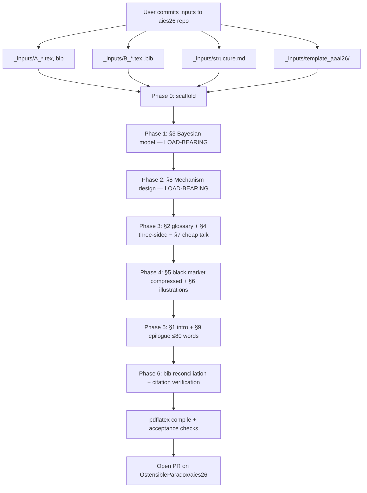

# Plan 01: Scaffold and Configuration

## Context

The arbitrage paper exists today in two stale layers — a ~278-line philosophical seed (`A`) and a ~980-line empirics-heavy expansion (`B`) — neither suitable for AIES 26. User is consolidating into one paper, retitled **"Ontological Arbitrage: Bayesian Equilibrium under Substrate Chauvinism"**, with a frozen thesis: substrate chauvinism (input) → Bayesian signaling game (formalism) → mechanism design (output).

A clean new repo `https://github.com/OstensibleParadox/aies26` has been created for this rebuild. Implementation runs there, not in the current planning workspace (`OstensibleParadox/credentials` clone at `/home/user/repo/`). The user will commit the source inputs (A, B, AAAI template, structure spec) to that new repo before implementation begins; the implementing agent finds them at the paths defined in §1 below.

Locked decisions (do not relitigate):
- Title + one-sentence thesis frozen (see `_inputs/structure.md`).
- Drop ALL empirics: no NPS-4, no Xiaohongshu, no Narcissus Mechanism, no Black Body Relation, no ablations, no Chinese-language exemplars.
- Genre: formal political economy / mechanism design.
- §3 players: **three** — Firm (F), User (U), Regulator (R). Publics/intellectuals fold into R as a noisy signal channel.
- Venue: AIES 26 via AAAI 2026 `\documentclass[letterpaper]{article}` + `\usepackage[submission]{aaai2026}`. pdflatex + natbib + bibtex.
- Archive A and B in `archive/`; commit to git.
- Drop positionality endmatter entirely.
- Levinas / agape: at most one ironic sentence in §9.

Intended outcome: a clean AAAI-2026-formatted LaTeX project (~7 body pages, ~4500–5500 body words) that compiles via pdflatex, with the 9-section structure below, archived originals, and full git history.

## Implementation flow



Section drafting is sequenced so the formal spine (§3) and its operative conclusion (§8) are pinned before downstream prose, which depends on them.

## 1. Expected input layout (user commits before implementation)

```
aies26/  (repo root)
├── _inputs/
│   ├── A_ontological_arbitrage.tex        # ~278 lines, philosophical seed
│   ├── A_ontological_arbitrage.bib
│   ├── B_aies26_arbitrage.tex             # ~980 lines, empirics-heavy expansion
│   ├── B_aies26_arbitrage.bib
│   ├── B_aies26_endmatter.tex
│   ├── structure.md                       # frozen 9-section spec; locked thesis
│   └── template_aaai26/
│       └── AnonymousSubmission/LaTeX/
│           ├── aaai2026.sty
│           ├── aaai2026.bst
│           └── (the rest of the kit; only .sty/.bst will be extracted)
└── .gitignore                              # at minimum: .DS_Store
```

If any of these are missing when the implementation agent starts, it must STOP and surface the gap rather than improvising replacements.

## 2. Target directory layout (after rebuild)

```
aies26/
├── .gitignore                              # extended w/ LaTeX artifacts (§6)
├── README.md                                # title, status, build command
├── STRUCTURE.md                             # = _inputs/structure.md (moved)
├── arbitrage.tex                            # main doc, AAAI 2026 docclass
├── arbitrage.bib                            # reconciled (§4)
├── aaai2026.sty                             # copied from _inputs/template_aaai26/
├── aaai2026.bst
├── sections/
│   ├── 00_frontmatter.tex                   # title + abstract + keywords
│   ├── 01_introduction.tex
│   ├── 02_conceptual_core.tex
│   ├── 03_bayesian_model.tex                # LOAD-BEARING
│   ├── 04_three_sided.tex
│   ├── 05_black_market.tex                  # compressed
│   ├── 06_illustrations.tex                 # stylized facts, NOT empirics
│   ├── 07_cheap_talk.tex
│   ├── 08_mechanism_design.tex              # LOAD-BEARING
│   └── 09_epilogue.tex
└── archive/                                 # committed
    ├── A_ontological_arbitrage.tex
    ├── A_ontological_arbitrage.bib
    ├── B_aies26_arbitrage.tex
    ├── B_aies26_arbitrage.bib
    └── B_aies26_endmatter.tex
```

Modular sections so §3/§8 revisions show as isolated diffs.

## 3. Phase 0 — Scaffold (single commit)

Operations (all paths relative to repo root):
1. `mkdir -p sections archive`
2. `mv _inputs/A_ontological_arbitrage.tex archive/`
3. `mv _inputs/A_ontological_arbitrage.bib archive/`
4. `mv _inputs/B_aies26_arbitrage.tex archive/`
5. `mv _inputs/B_aies26_arbitrage.bib archive/`
6. `mv _inputs/B_aies26_endmatter.tex archive/`
7. `mv _inputs/structure.md STRUCTURE.md`
8. `cp _inputs/template_aaai26/AnonymousSubmission/LaTeX/aaai2026.sty .`
9. `cp _inputs/template_aaai26/AnonymousSubmission/LaTeX/aaai2026.bst .`
10. `rm -rf _inputs/`
11. Create `sections/00_frontmatter.tex` … `sections/09_epilogue.tex` as stubs (each: section header + `% TODO`).
12. Create `arbitrage.tex` with AAAI 2026 preamble (§5 below) and `\input{sections/*}`.
13. Create empty `arbitrage.bib` (entries land in Phase 6).
14. Create `README.md` (one paragraph: title, status, build command).
15. Extend `.gitignore` (§6 below).
16. Initial scaffold commit.

After this commit, run `pdflatex arbitrage` once to confirm the stub document compiles before any prose is added.

## 4. AAAI 2026 build configuration

Preamble for `arbitrage.tex`:
- `\documentclass[letterpaper]{article}`
- `\usepackage[submission]{aaai2026}` (anonymous-submission mode)
- Required by the template: `times`, `helvet`, `courier`, `url[hyphens]`, `graphicx`, `natbib`, `caption`, `algorithm`, `algorithmic`.
- Add: `amsmath`, `amsthm`, `amssymb`, `mathtools`, `booktabs`, `tikz` (for §3 Figure 1 game tree), `hyperref` (after `natbib`).
- **Forbidden by the template** (must not appear anywhere): `authblk`, `balance`, `CJK`, `float`, `flushend`, `fontenc`, `fullpage`, `geometry`, `titlesec`, `titling`, `biblatex`, `fontspec`, `unicode-math`, `setspace`, `microtype`, `subcaption`, `luatexja-fontspec`.

Build command (must be re-runnable from clean):
```bash
pdflatex arbitrage && bibtex arbitrage && pdflatex arbitrage && pdflatex arbitrage
```

Page target: **7 body pages + unlimited references** (AAAI 2026 / AIES 26 limit). Word target in body: 4500–5500 (verify via `texcount -inc arbitrage.tex`).

## 5. .gitignore extension

Append to whatever `.gitignore` exists:

```
# LaTeX build artifacts
*.aux
*.log
*.synctex.gz
*.bbl
*.blg
*.toc
*.out
*.run.xml
*.fdb_latexmk
*.fls
*.nav
*.snm
*.vrb
*.lof
*.lot
# macOS
.DS_Store
```

`*.pdf` NOT gitignored — AAAI submission requires PDF; the final compiled PDF gets committed once at the end. If draft PDFs cause review noise, gitignore later with `!arbitrage.pdf` override.

## 6. Critical files to create / modify

- **Create**: `arbitrage.tex`, `arbitrage.bib`, `README.md`, `STRUCTURE.md` (moved), `sections/00_frontmatter.tex` … `sections/09_epilogue.tex`.
- **Move**: 5 input files into `archive/`; `_inputs/structure.md` → `STRUCTURE.md`.
- **Copy out**: `aaai2026.sty`, `aaai2026.bst` from `_inputs/template_aaai26/AnonymousSubmission/LaTeX/`.
- **Delete**: entire `_inputs/` tree after extraction.
- **Extend**: `.gitignore`.
