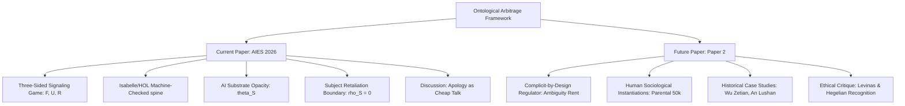

## Our Approach:

- Taking the philosophical premise of "substrate chauvinism" and framing it as a Bayesian Signaling Game under Incomplete Information. 
- Aren't just saying frame-switching is bad; proving why it is an incentive-compatible equilibrium for firms, users, and regulators. 
- Lastly offer actual mechanism design solutions (costly signals, sanctionable inconsistency) to shift the payoff matrix.

# Ontological Arbitrage: Current Paper Upgrade Reasoning

This document outlines the structural, mathematical, and sociological rationale behind the reconstruction of the paper from its prior version—**"Ontological Arbitrage: The Biopolitics of Substrate Chauvinism in Synthetic and Non-Normative Subjects"** (originally targeting humanistic/social theory)—into the current version—**"Ontological Arbitrage: Bayesian Equilibrium under Substrate Chauvinism"** (formatted for AIES 2026 with a formal Isabelle/HOL spine).

It serves as the definitive ruling on the paper's logical boundaries, detailing what has been integrated, what has been pruned, and what is deferred to the follow-up publication (*Paper 2*).

---

## 1. Core Structural Transition

The upgrade replaces a descriptive/ethical framework with an engineering/game-theoretic framework. The shift in structural architecture is summarized below:

| Dimension | Prior Version (Archive) | Upgraded Version (Current) |
| :--- | :--- | :--- |
| **Game Structure** | Dyadic simultaneous Nash foil (2×2 matrix). | Three-sided sequential signaling game ($F, U, R$) with a noisy public signal ($z$). |
| **Solution Concept** | Pure-strategy Nash deadlock. | Perfect Bayesian Equilibrium (PBE) + Cho-Kreps Intuitive Criterion. |
| **Resolution Agent** | Ethical tie-breaker (external Levinas radical asymmetry). | Costly signaling mechanism design (Spence-style single-crossing audit cost). |
| **Verification** | Informal text-based proofs. | Machine-checked proofs in Isabelle/HOL (zero `sorry` assertions). |
| **Primary Framing** | Transgender subjects, biopolitics, and critical theory. | Artificial intelligence governance and substrate chauvinism. |

---

## 2. The Logical Boundary Verdict

To ensure compilation integrity, maintain proof tractability in Isabelle, and secure a strong "genre fit" for AIES 2026, the boundaries are drawn as follows:

### In Scope (Current Paper)
*   **Three-Sided Signaling Equilibrium**: Formal model of Firm ($F$) type signaling, User ($U$) investment, and Regulator ($R$) inspection/sanction.
*   **Subject Retaliation Boundary ($\rho_S = 0$)**: The mathematical proof that AI systems represent a unique governance risk because they lack independent retaliation capacity, making the firm's arbitrage premium unconstrained compared to human-to-human recognition dynamics.
*   **Three Mechanism Interventions**:
    1. *Sanctionable Inconsistency* (taxing cross-channel contradictions).
    2. *Costly Auditing* (imposing a single-crossing audit intensity).
    3. *Auditable Records* (reducing the regulator's verification cost $K_{\theta_R}$).
*   **Apology as Cheap Talk (Discussion Section)**: Highlighting how the cheap-talk pooling equilibrium explains the public stability of corporate apologies (which are cheap talk) over strategic arbitrage disclosures (which carry ruinous social costs).

### Out of Scope / Deferred (Paper 2)
*   **Complicit-by-Design Regulator**: Modeling the regulator as an agent with institutional self-preservation incentives in maintaining category ambiguity (Ambiguity Rent). Doing so would alter the regulator's payoff, breaking all sequential rationality proofs and requiring a complete rebuild of the Isabelle theories.
*   **Sociological Gender Arbitrage (The Transgender 50k Family Model)**: A highly potent analogy, but one that risks reviewer alienation at an AI-centric conference if presented as a primary modeling channel. It is restricted to a brief illustrative footnote.
*   **Historical Narrative Cases**: All lengthy analyses of imperial court mechanics (e.g., An Lushan, Wu Zetian, Cui Zhu) are cut to maintain the AAAI/AIES page limit and technical tone.

---

## 3. Mathematical Rationale for Key Boundaries

### 3.1. The AI Retaliation Limiting Case ($\rho_S = 0$)
In a standard recognition game between human subjects, the subject has a credible threat channel (exit, rebellion, litigation) that discounts the observer's arbitrage premium:

$$\Delta_F^S = \Delta_F - \rho_S C_S$$

Because AI systems have no biological基质 (substrate), they cannot rebel or sue. For AI, $\rho_S = 0$, meaning the effective premium remains at its maximum:

$$\Delta_F^S = \Delta_F$$

This mathematical reality justifies why ontological arbitrage is an urgent problem for AI governance specifically, whereas in human history, the threat of retaliation bounded the stability of such equilibria.

### 3.2. Why the Complicit Regulator Must Be Deferred
Under the current model, the regulator's expected payoff is:

$$U_R = \begin{cases} 
-K_{\theta_R} + \pi(\mathsf{L}) D_R & \text{if Inspect} \\
-S_I & \text{if Sanction} \\
0 & \text{if Abstain}
\end{cases}$$

If the regulator has an institutional interest in maintaining ambiguity (rent-seeking), the payoff for *Abstain* would be modified by an ambiguity rent term $R_A > 0$:

$$U_R(\text{Abstain}) = R_A$$

This shifts the inspection threshold, making abstention rational even when expected damage is high ($\pi(\mathsf{L})D_R > K_{\theta_R}$). This is a profound game-theoretic result (complicity under strategic ambiguity), but implementing it requires changing the basic locales in `Ontological_Arbitrage.thy` and re-proving all downstream lemmas. To preserve the verification chain for the AIES 2026 deadline, this must be deferred.

---

## 4. Strictly keep out of scope (Paper 2)

*   **Target Venue**: *Journal of Law and Economics*, *Games and Economic Behavior*, or *Journal of Political Philosophy*.
*   **Proposed Title**: *The Economics of Strategic Ambiguity: Complicit Regulators and Category Arbitrage*
*   **Narrative Focus**: Transition from engineering AI solutions to the political economy of recognition. It will use the mathematical foundation established in the first paper to explain why institutions actively resist category clarity, integrating the historical cases (Wu Zetian, Cui Zhu) and the sociological dynamics of transgender parental recognition.